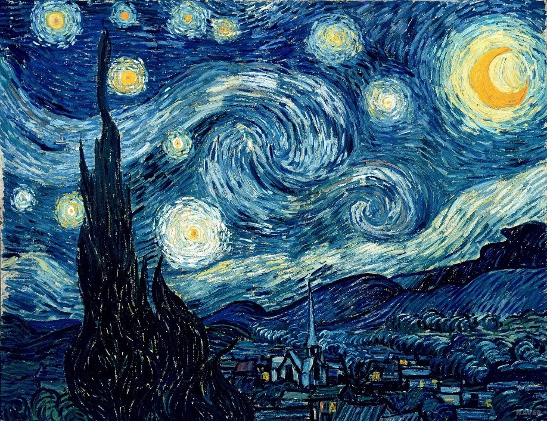
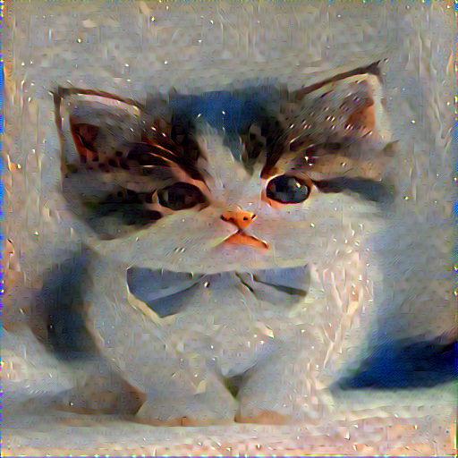
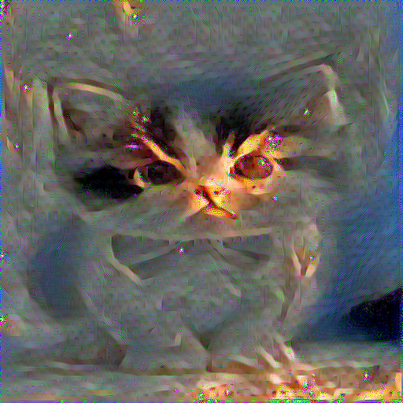
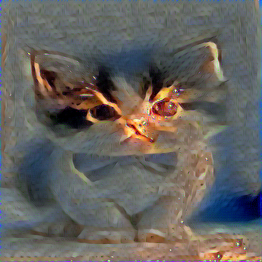
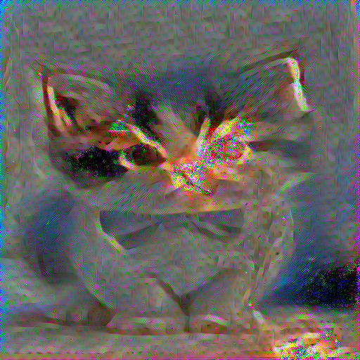

# Neural Style Transfer Implementation

This repository contains a PyTorch implementation of the Neural Style Transfer algorithm based on the paper [Image Style Transfer Using Convolutional Neural Networks](https://www.cv-foundation.org/openaccess/content_cvpr_2016/papers/Gatys_Image_Style_Transfer_CVPR_2016_paper.pdf) by Gatys et al. (CVPR 2016).

## Overview

Neural Style Transfer is an optimization technique used to take two images—a content image and a style reference image—and blend them together so the output image retains the core elements of the content image, but appears to be "painted" in the style of the style reference image.

## Implementation Details

### Architecture
- Uses VGG19 as the base network for feature extraction
- Content features are extracted from layer `conv4_2`
- Style features are extracted from layers `['conv1_1', 'conv2_1', 'conv3_1', 'conv4_1', 'conv5_1']`
- Implements Gram Matrix computation for style representation

### features
- Option to initialize from random noise or content image
- Intermediate result saving during training
- Configurable input image size (default: 512px)

## Project Structure
```
neural_style_transfer/
├── data/
│   ├── content.jpg
│   └── style2.jpg
├── model.py       # StyleTransfer model implementation
├── loss.py        # Content and Style loss implementations
├── train.py       # Training script
├── tests/         # Unit tests
└── result/        # Generated outputs
```

## Requirements
- Python 3.x
- PyTorch
- torchvision
- PIL
- tqdm

## Training Environment
- Google Colab with NVIDIA T4 GPU
- CUDA enabled PyTorch

## Usage

1. Place your content image in `data/content.jpg`
2. Place your style image in `data/style2.jpg`
3. Run the training script:
```bash
python train.py
```

### Hyperparameters
The implementation uses the following default hyperparameters:
- Style weight: 1e6
- Content weight: 1
- Learning rate: 0.1 / 1
- Number of epochs: 1000
- Input image size: 512x512
- Optimizer: Adam / LPBFG

## Results

The training process saves intermediate results every 50 epochs in the `result/` directory. The output path is automatically generated based on the hyperparameters used (e.g., `result/adam_1e6_0.1/`).

### Optimizer Comparison: Adam vs L-BFGS

We compared two optimization methods for style transfer:

#### Adam Optimizer
- Slower convergence but stable training
- Takes about 300 epochs to achieve good style transfer
- Parameters:
  - Learning rate: 0.1
  - Style weight: 1e6
  - Content weight: 1

```
Optimization Progress (Adam):
Epoch 50   -> Initial style elements appear, but content structure dominates
Epoch 1000 -> Further refinement of style details
```

#### L-BFGS Optimizer
- Significantly faster convergence
- Achieves similar quality as Adam's 300 epoch result in just 50 epochs
- Parameters:
  - Learning rate: 1
  - Style weight: 1e6
  - Content weight: 1

### Key Findings
- L-BFGS converges approximately 6x faster than Adam for this task
- L-BFGS shows better optimization efficiency for style transfer, but each iteration takes longer than Adam
- Adam requires more iterations but provides more stable, gradual style application

### Visual Comparison

#### Content and Style Images
| Content Image | Style Image |
|:-------------:|:-----------:|
|  |  |

#### Adam Optimizer Progress
| Epoch 50 | Epoch 1000 |
|:--------:|:----------:|
|  |  |

#### L-BFGS Optimizer Progress
| Epoch 50 | Epoch 1000 |
|:--------:|:----------:|
|  |  |

As shown in the images above:
- L-BFGS achieves decent-quality style transfer in just 50 epochs
- Adam requires more epochs but shows gradual style application
- The final results (epoch 1000) show comparable quality, with L-BFGS achieving this quality much earlier in the training process

The complete results are saved in their respective directories:
- Adam results: `result/adam_1e6_0.1/`
- L-BFGS results: `result/lbfgs_1e6_1/`

### Training Progress
- Intermediate results are saved every 50 epochs
- Progress logging includes:
  - Style Loss
  - Content Loss
  - Total Loss
  - Current epoch progress

## Implementation Notes

### Style Loss
- Implements style loss using Gram matrices
- Stores both target feature maps and their Gram matrices for efficiency
- Uses MSE loss between Gram matrices

### Content Loss
- Direct MSE loss between content features
- Extracted from middle layers of VGG network

## Citation

```bibtex
@inproceedings{gatys2016image,
  title={Image style transfer using convolutional neural networks},
  author={Gatys, Leon A and Ecker, Alexander S and Bethge, Matthias},
  booktitle={Proceedings of the IEEE conference on computer vision and pattern recognition},
  pages={2414--2423},
  year={2016}
}
```

## License
MIT License
